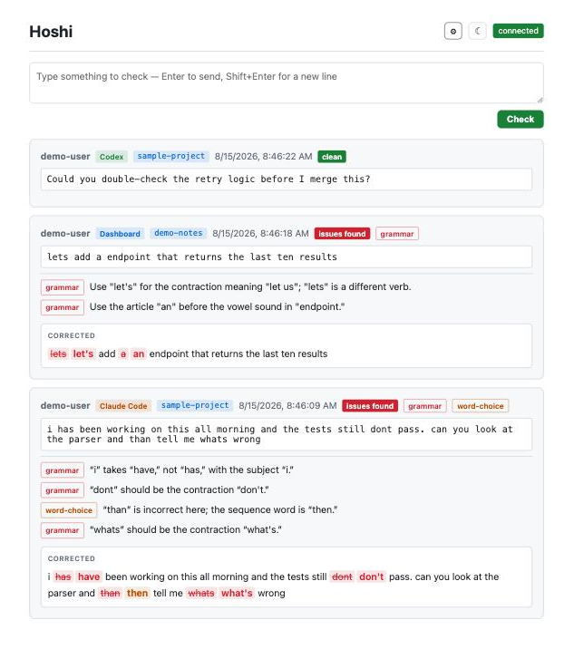

# Hoshi

A grammar teaching tool for coding agents — [Claude Code](https://docs.anthropic.com/en/docs/claude-code) and [Codex CLI](https://developers.openai.com/codex/cli). Hooks into your prompts, checks grammar via configurable LLM providers (Anthropic, OpenAI, Gemini), and displays explanations on a real-time web dashboard.

The goal is to help you learn better writing habits — Hoshi explains what's wrong and why, it doesn't rewrite your text.

<!-- 830px wide, shown at 620, so it stays crisp on hi-dpi screens without the
     image taking over the page. -->
<p align="center">
  
</p>

Each result says which agent and project it came from. Findings are tagged with
their type, and the correction is shown as a diff — what you wrote struck
through, the replacement beside it in the colour of the issue it fixes — so the
edit is visible without re-reading the sentence to find it. Informal wording is
left alone; style notes are shown but never counted as mistakes. The dashboard
follows your system theme, with a toggle to override it.

## How it works

```
agent prompt → async hook (curl) → FastAPI backend → LLM grammar check → WebSocket → Dashboard
```

1. You type a prompt in Claude Code or Codex CLI
2. A `UserPromptSubmit` hook fires asynchronously (never blocks your workflow)
3. The server checks grammar via your configured LLM provider
4. Results appear in real-time on a web dashboard

## Quick start

### 1. Configure the server

```bash
cp .env.example .env
cp tokens.json.example tokens.json
```

Edit `.env` with your LLM provider and API key:

```
PROVIDER=openai              # or: anthropic, gemini
MODEL=gpt-5.6-terra          # any model from your provider
OPENAI_API_KEY=sk-...        # key for your chosen provider
WS_TOKEN=your-secret-token   # must match a key in tokens.json
```

Edit `tokens.json` — map tokens to usernames:

```json
{
  "your-secret-token": "yourname"
}
```

### 2. Start the server

```bash
docker compose up -d
```

Dashboard is at `http://localhost:8080`. It has no login of its own: the port is
published on loopback only, so nothing off the machine can reach it. Exposing it
to a network means changing the port binding in `docker-compose.yml` **and**
putting authentication in front — the dashboard HTML carries `WS_TOKEN`.

### 3. Install the hook

```bash
mkdir -p ~/.hoshi
cp hook/hook.sh ~/.hoshi/hook.sh
chmod +x ~/.hoshi/hook.sh
```

Create `~/.hoshi/config` (`chmod 600` — it holds your token):

```sh
: "${HOSHI_SERVER_URL:=http://localhost:8080}"
: "${HOSHI_TOKEN:=your-secret-token}"
# : "${HOSHI_LOG:=$HOME/.hoshi/hook.log}"   # uncomment to log every run
```

Environment variables still win if set, but the file is what makes this work when
Claude Code is launched from the desktop app, which never sources your shell rc.

**Claude Code** — add the hook to `~/.claude/settings.json`. If you already have
`UserPromptSubmit` hooks, add this alongside them rather than replacing the array:

```json
{
  "hooks": {
    "UserPromptSubmit": [
      {
        "hooks": [
          {
            "type": "command",
            "command": "~/.hoshi/hook.sh claude-code",
            "async": true
          }
        ]
      }
    ]
  }
}
```

**Codex CLI** — add the same hook to `~/.codex/config.toml`. Codex sends the
identical `UserPromptSubmit` payload, so it is the same script:

```toml
[[hooks.UserPromptSubmit]]
[[hooks.UserPromptSubmit.hooks]]
type = "command"
command = "$HOME/.hoshi/hook.sh codex"
```

Codex asks you to trust a hook the first time it sees one, and records the
approval as a `trusted_hash` under `[hooks.state]` — editing the command means
trusting it again.

Start typing prompts — grammar check results appear on the dashboard.

## Supported providers

| Provider | `PROVIDER` | `MODEL` example | API key env var |
|----------|-----------|-----------------|-----------------|
| Anthropic | `anthropic` | `claude-sonnet-5` | `ANTHROPIC_API_KEY` |
| OpenAI | `openai` | `gpt-5.6-terra` | `OPENAI_API_KEY` |
| Google Gemini | `gemini` | `gemini-2.5-flash` | `GEMINI_API_KEY` |

Only set the API key for the provider you're using.

## Development

```bash
uv sync --extra dev
uv run task check      # lint + typecheck + tests
```

Individual tasks: `uv run task lint | typecheck | test | fix | format`.

### Hook configuration

The hook reads `HOSHI_SERVER_URL` and `HOSHI_TOKEN` from the environment, falling
back to `~/.hoshi/config` — which matters because Claude Code started from the
desktop app never sources your shell rc. Set `HOSHI_LOG` to a path to record
every invocation; the hook is otherwise silent, so a missing dashboard entry
gives no clue whether the prompt was skipped or the hook never ran.

One script serves both agents: Claude Code and Codex CLI send the same
`UserPromptSubmit` fields (`prompt`, `cwd`, `session_id`, `transcript_path`),
and the extras Codex adds are ignored.

Each result is labelled twice — with the basename of `cwd` for the project, and
with the agent named by the hook's first argument (`claude-code`, `codex`;
anything else that is a lowercase slug also works, and gets a neutral tag).
The agent is named rather than sniffed from the payload: the two agents send the
same fields, and whichever one happens to tell them apart today is not a
promise. Omit the argument and it defaults to `claude-code`.

Not checked: slash commands (`/daily`), harness injections
(`<task-notification>`, `<system-reminder>`), and empty prompts.

**Queued messages (Claude Code only).** Text typed while Claude is still working is enqueued rather
than submitted, so `UserPromptSubmit` never fires for it — Claude Code records it
as a `queue-operation` entry instead of a user prompt. The hook replays those
from the session transcript on its next run, so they show up one prompt late
rather than not at all. A session's backlog is not replayed the first time the
hook sees it.

### Debug view

The ⚙ toggle in the header reveals a `debug` button on every result. The panel
shows whether any highlighted span actually changed anything, a word-level diff
against your original, the model and latency behind the check, and the raw
response.

It exists because the model occasionally reports a mistake that is not there —
claiming a word is missing when it is already present, then "correcting" the
text to what it already said. A span that changed nothing is the tell. Nothing
is suppressed on that basis: the analysis is shown, and the judgement is yours.

## Data retention

Results live in memory only — the last 1000 are retained and served to the
dashboard via `GET /api/results` when it connects, so a page refresh restores
the recent feed. Restarting the backend clears everything.

## Project structure

```
hoshi/
├── backend/
│   ├── main.py              # FastAPI app (/api/check, /api/results, /api/health, /ws)
│   ├── auth.py              # Bearer token validation
│   ├── config.py            # Settings from env vars
│   ├── store.py             # In-memory store + WebSocket broadcast
│   ├── providers/
│   │   ├── __init__.py      # GrammarProvider protocol + factory
│   │   ├── anthropic.py
│   │   ├── openai.py
│   │   └── gemini.py
│   └── tests/
├── frontend/
│   ├── nginx.conf           # Static files + reverse proxy to backend
│   └── static/              # Dashboard (HTML/JS/CSS)
├── hook/
│   └── hook.sh              # Claude Code hook script
├── docker-compose.yml
├── .env.example
└── tokens.json.example
```

## License

MIT
